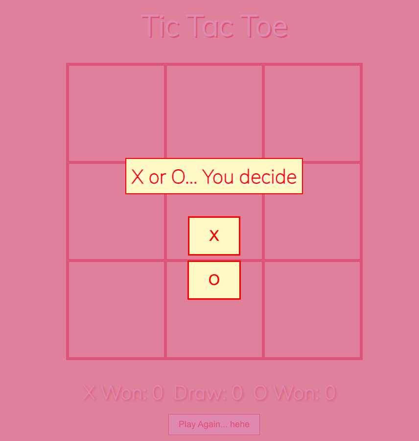
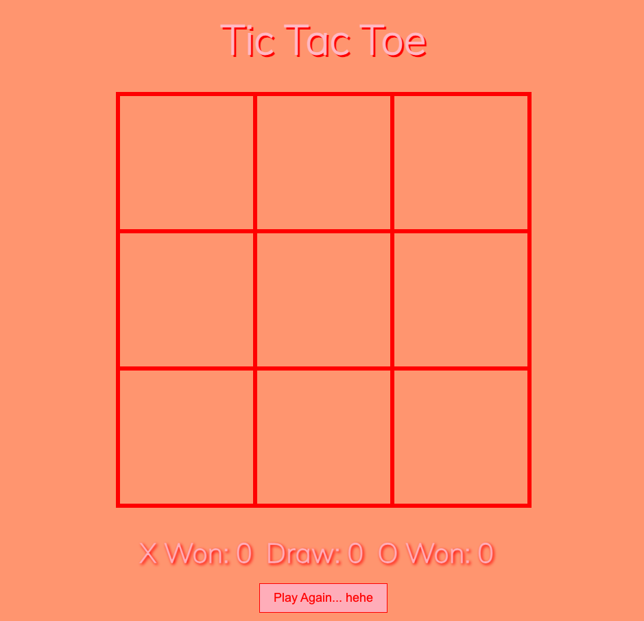

# Tic Tac Toe

## Introduction

 This game is the first I have made. It was a huge challenge to even know where to start but with some pointers we got there in the end. I am very proud of what i have made.

 Some would say it is basic, but not I... Hehe

## Overview

I have transformed the classic game of Tic Tac Toe into an engaging web game using HTML, CSS, JavaScript and mutimedia elements. Once a player has selected their symbol, they experience a user friendly interface with sound effects for wins and draws.

## Features

- Player Selection
- Win and Draw Sounds
- Responsive Design
- Score Tracking

## Play

[Link to the game here.](https://jemmaclark.github.io/SEI-project-1/)

## Preview

Player selection

Game Board

